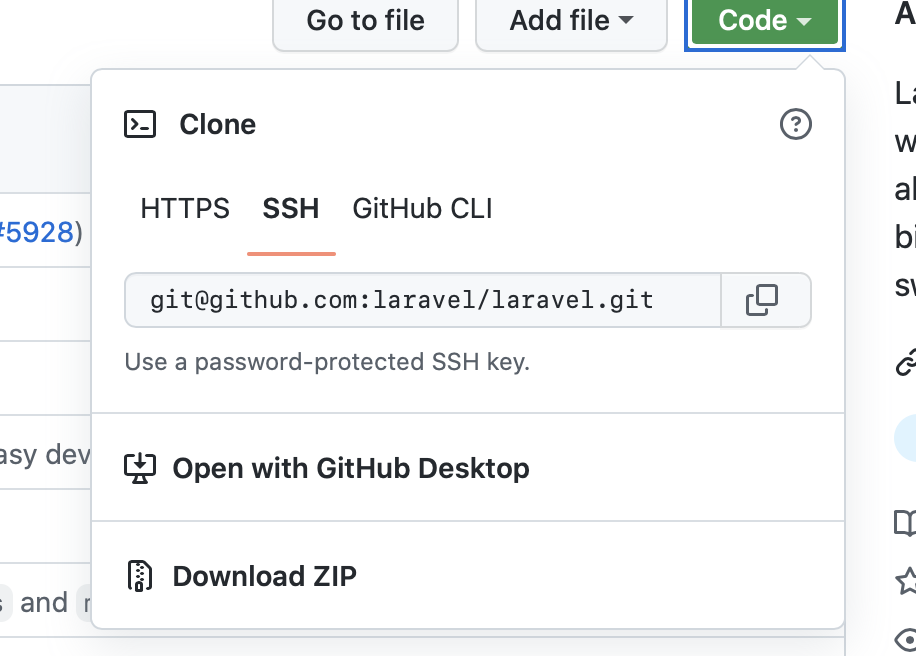

# Install and Configure Laravel with Nginx
## 1. Installing Nginx

1. Install Nginx using following commands:
    + `$sudo apt update`
    + `$sudo apt install nginx`
    
2. Adjust the firewall to nginx using this command:
    + `$sudo ufw allow 'Nginx HTTP'`
    
3. You can check web server status with this command:
    + `$systemctl status nginx`
    
4. And the following commands help you to manage your web server:
    + to Stop web server:
      - `$sudo systemctl stop nginx`
    + to Start web server:
      - `$sudo systemctl start nginx`
    + to Restart web server:
      - `$sudo systemctl restart nginx`
    + to Reload web server:
      - `$sudo systemctl reload nginx`
      
5. By default, Nginx is configured to start automatically when the server
boots. If this is not what you want, you can disable this behavior by typing:
    + Disable this behavior:
      - `$sudo systemctl disable nginx`
    + Re-enable the service:
      - `$sudo systemctl enable nginx`
      
## 2. Installing Required PHP modules:

Following command will install required PHP modules:
    + `$sudo apt install php-mbstring php-xml php-bcmath php-curl`

## 3. Creating a Database for the Application:

1. log in to the MySQL console as the root database user with:
    + `$sudo mysql`
  
2. To create a new database, run the following command from your MySQL console:
    + `CREATE DATABASE db_name;`
  
3. create a new user and grant them full privileges on the custom database you’ve just created. In this example, we’re creating a user named username with the password password, though you should change this to a secure password of your choosing:
    + `CREATE USER 'username'@'%' IDENTIFIED WITH mysql_native_password BY 'password';`
  
4. give this user permission over `db_name` database:
    + `GRANT ALL ON db_name.* TO ‘usename'@'%';`

5. exit the MySQL shell:
    + `exit`
  
6. test if the new user has the proper permissions by logging in to the MySQL console again, this time using the custom user credentials:
    + `$mysql -u username -p`
  
7. confirm that you have access to the db_name database:
    + `SHOW DATABASES;`
  
8. create a table named example in the db_name database. From the MySQL console, run the following statement:
   + `CREATE TABLE db_name.example (id INT AUTO_INCREMENT,name VARCHAR(255),visited BOOLEAN,PRIMARY KEY(id));`
   
9. populate the example table with some sample data:
   + `INSERT INTO db_name.example (name, used) VALUES ("A", false),("B", true),("C", false),("D", true),("E", true),("F", false),("G", false),("H", false),("I", true),("J", false),`
   
10. confirm that the data was successfully saved to your table, run:
    + `SELECT * FROM db_name.example;`
   
11. exit the MySQL console:
     + `exit`
   
## 4. New Laravel Project

### 1. Creating one:
   You will now create a new Laravel application using the composer create-
project command. This Composer command is typically used to bootstrap new
applications based on existing frameworks and content management systems.
Throughout this guide, we’ll use travellist as an example application, but you are
free to change this to something else. The travellist application will display a list
of locations pulled from a local MySQL server, intended to demonstrate Laravel’s
basic configuration and confirm that you’re able to connect to the database.

   + 1.go to your user’s home directory:
      - `$cd ~`
   
   + 2.The following command will create a new `project` directory containing a barebones Laravel application based on default settings:
      - `$composer create-project --prefer-dist laravel/laravel project`
    
   + 3.access the application’s directory and run Laravel’s artisan command to verify that all components were successfully installed:
      - `$cd project`
      - `$php artisan`
      
### 2. Getting from Github:
   + 1.go to destination directory
   
   + 2.open project in GitHub
   
   + 3.get ssh from this part (detail of making ssh key in the end)
      
   
   + 4.Clone the project:
     - `$git clone git@github.com:laravel/laravel.git`
      
## 5. Configuring Laravel
  The Laravel configuration files are located in a directory called config, inside the application’s root directory. Additionally, when you install Laravel with Composer, it creates an environment file. This file contains settings that are specific to the current environment the application is running, and will takeprecedence over the values set in regular configuration files located at the config directory. Each installation on a new environment requires a tailored environment file to define things such as database connection settings, debug options, application URL, among other items that may vary depending on which environment the application is running. We’ll now edit the .env file to customize the configuration options for the current application environment
   + 1.Open the .env file using your command line editor of choice. Here we’ll use nano:
     - `$nano .env`
    
Even though there are many configuration variables in this file, you don’t
need to set up all of them now. The following list contains an overview of the
variables that require immediate attention:
+ `APP_NAME`: Application name, used for notifications and messages.
+ `APP_ENV`: Current application environment.
+ `APP_KEY`: Used for generating salts and hashes, this unique key is automatically created when installing Laravel via Composer, so you don’t need to change it.
+ `APP_DEBUG`: Whether or not to show debug information at client side.
+ `APP_URL`: Base URL for the application, used for generating application links.
+ `DB_DATABASE`: Database name.
+ `DB_USERNAME`: Username to connect to the database.
+ `DB_PASSWORD`: Password to connect to the database.    
By default, these values are configured for a local development environment that
uses Homestead, a prepackaged Vagrant box provided by Laravel. We’ll change
these values to reflect the current environment settings of our example
application.
In case you are installing Laravel in a development or testing environment, you
can leave the APP_DEBUG option enabled, as this will give you important debug
information while testing the application from a browser. The APP_ENV variable
should be set to development or testing in this case.
In case you are installing Laravel in a production environment, you should
disable the APP_DEBUG option, because it shows to the final user sensitive
information about your application. The APP_ENV in this case should be set to
production.   
The following .env file sets up our example application for development:
+ `APP_NAME= project`
+ `APP_ENV= development`
+ `APP_KEY= APPLICATION_UNIQUE_KEY_DONT_COPY`
+ `APP_DEBUG= true`
+ `APP_URL=http://domain_or_IP`

+ `LOG_CHANNEL=stack`

+ `DB_CONNECTION=mysql`
+ `DB_HOST=localhost`
+ `DB_PORT=3306`
+ `DB_DATABASE=db_name`
+ `DB_USERNAME=travellist_user`
+ `DB_PASSWORD=password`    
Adjust your variables accordingly. When you are done editing, save
and close the file to keep your changes. If you’re using nano, you can do that
with CTRL+X, then Y and Enter to confirm.
Your Laravel application is now set up, but we still need to configure the web
server in order to be able to access it from a browser. In the next step, we’ll
configure Nginx to serve your Laravel application.
+ To test database connection and everything go to project directory and run this:
  - `$sudo php artisan migrate`
 
## 6. Setting Up Nginx
  We have installed Laravel on a local folder of your remote user’s home
directory, and while this works well for local development environments, it’s not
a recommended practice for web servers that are open to the public internet.
We’ll move the application folder to /var/www, which is the usual location for
web applications running on Nginx.  
  + 1.use the mv command to move the application folder with all its contents to `/var/www/project`:
   - `$sudo mv ~/project /var/www/project`
  
  + 2.Now we need to give the web server user write access to the `storage` and `cache` folders, where Laravel stores application-generated files:
    - `$sudo chown -R www-data.www-data /var/www/project/storage`
    - `$sudo chown -R www-data.www-data /var/www/project/bootstrap/cache`
    
  + 3.The application files are now in order, but we still need to configure Nginx to serve the content. To do this, we’ll create a new virtual host configuration file at `/etc/nginx/sites-available`:
    - `$sudo nano /etc/nginx/sites-available/project`
    
  + 4.The following configuration file contains the recommended settings for Laravel applications on Nginx:
      - [My Config File](laravel)   <be>
    Copy this content to your `/etc/nginx/sites-available/project` file and, if
necessary, adjust the highlighted values to align with your own configuration.
Save and close the file when you’re done editing.

   + 5.To activate the new virtual host configuration file, create a symbolic link to project in `sites-enabled`:
    - `$sudo ln -s /etc/nginx/sites-available/project /etc/nginx/sites-enabled/`
    
   + 6.To confirm that the configuration doesn’t contain any syntax errors, you can use:
    - `$sudo nginx -t`
    
   + 7.To apply the changes, reload Nginx with:
    - `$sudo systemctl reload nginx`
    
   + 8.Now go to your browser and access the application using the server’s domain name or IP address, as defined by the `server_name` directive in your configuration file:
    - `http://server_domain_or_IP`

# Sourse
  + [Installing Composer on Ubuntu](https://www.digitalocean.com/community/tutorials/how-to-install-and-use-composer-on-ubuntu-22-04)
  + [Installing Apache on Ubuntu](https://www.digitalocean.com/community/tutorials/how-to-install-the-apache-web-server-on-ubuntu-22-04)
  + [Installing Nginx on Ubuntu](https://www.digitalocean.com/community/tutorials/how-to-install-nginx-on-ubuntu-22-04)
  + [Install & Configure Laravel with Nginx on Ubuntu](https://www.digitalocean.com/community/tutorials/how-to-install-and-configure-laravel-with-nginx-on-ubuntu-22-04)
  
## ssh key help
  + [Generate ssh key](https://docs.github.com/en/authentication/connecting-to-github-with-ssh/generating-a-new-ssh-key-and-adding-it-to-the-ssh-agent)
## Fastcgi
  + [Nginx Examples](https://www.nginx.com/resources/wiki/start/topics/examples/fastcgiexample/)
  + [Understanding & Implementing](https://www.digitalocean.com/community/tutorials/understanding-and-implementing-fastcgi-proxying-in-nginx)
## Proxy_Pass
  + [Configure Nginx as a web server & reverse proxy for Apache on Ubuntu](https://www.digitalocean.com/community/tutorials/how-to-configure-nginx-as-a-web-server-and-reverse-proxy-for-apache-on-one-ubuntu-20-04-server)
  + [Nginx Admin Guide](https://docs.nginx.com/nginx/admin-guide/web-server/reverse-proxy/)
  + [Nginx proxy modules](http://nginx.org/en/docs/http/ngx_http_proxy_module.html)
